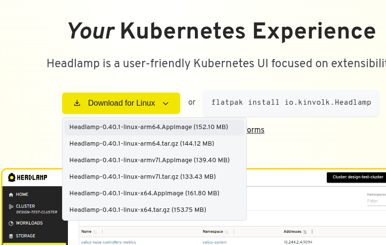
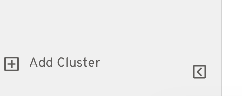
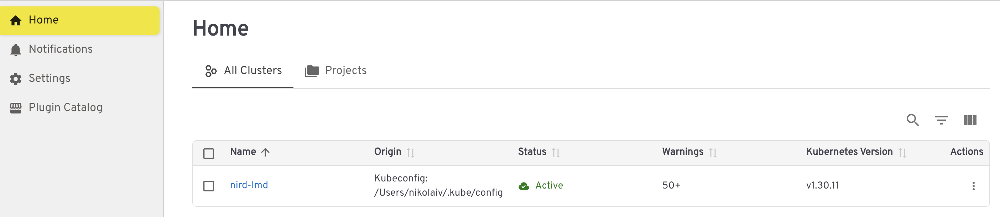
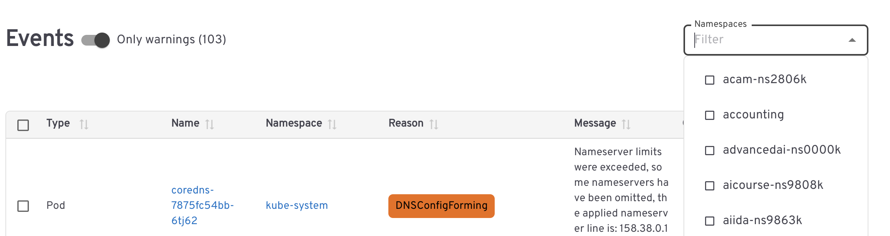
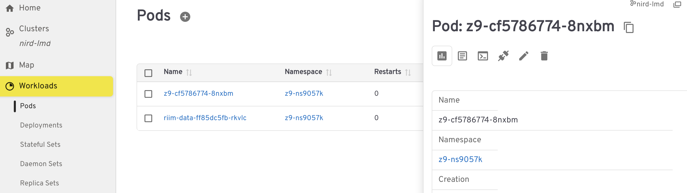

# nird-toolkit-auth-helper

## Installing nird-toolkit-auth-helper
You can download compiled binaries from the github release page.

### From source

```shell
$ go install github.com/UNINETTSigma2/nird-toolkit-auth-helper@latest
```

### Minimal kubeconfig

* Where to put the minimal kubeconfig

The minimal kubeconfig block below shall be placed in a file named `config` and located in the directory `$HOME/.kube/`. E.g. your config shall be here : `$HOME/.kube./config`. If the `.kube` directory and the `config` file are missing, just create them.

* Minimal kubeconfig content (to be copied into the file `config`)

```yaml
apiVersion: v1
clusters:
- cluster:
    certificate-authority-data: LS0tLS1CRUdJTiBDRVJUSUZJQ0FURS0tLS0tCk1JSUZFRENDQXZpZ0F3SUJBZ0lVTUpyTWIyTjRQbGFqQTNqNmwrYjVUc3I3K05vd0RRWUpLb1pJaHZjTkFRRU4KQlFBd0lERWVNQndHQTFVRUF4TVZUa2xTUkMxVFVDQkxkV0psY201bGRHVnpJRU5CTUI0WERUSXlNRGd5TmpFeQpNalV3TUZvWERUTXlNRGd5TmpBd01qVXdNRm93SURFZU1Cd0dBMVVFQXhNVlRrbFNSQzFUVUNCTGRXSmxjbTVsCmRHVnpJRU5CTUlJQ0lqQU5CZ2txaGtpRzl3MEJBUUVGQUFPQ0FnOEFNSUlDQ2dLQ0FnRUF0MytISUx3WUVDUlcKcmNtYUx0VU0rdVpKRFc0dkJCSEVWazk3SHo2YmtyaE93N0l4Q3Zmd2hud0NwNTIzUnZHZVpSbUpacUFsQzFadgp4MFdCTlhvbEpWS0lyalZPVXk3dklzdnNibDdrb296ckVQWjdCaGlnWDU1ekVXZ3diU3V2M0k5cFhWMVEzM3hiCkFGbXFIMlJDdWJvMWtiR1VLSHFjaFRRNHlIVnpIV2J4SEcrK1kyN1J1a0ZBNnhPU3ZBdDk3WlVFeHd6LytUdUwKT0JPR1ZSKzU4SFhtdmtKNHBKMW1xYzRBZWJLZ01Xc3F2djVYT0duYTJuVlRkbzd6QmtSbWVhcFF5NHNHTllJbAo0Wkp6S3JRaXdMRG4rcWZ0bGVsVU9aYlBNOElMZDdSYno0TkNjbWwzcWg1QjdjSjlubm1rQ1IyOCsyb2N0dVBMCjMrM1dBNGZBYUFiZ2laZHA5c1dFdytOZUV3MTFZR2wvNFd6cTZUVHR2dk5pVWhWV3BNa2Y4NlhxSEJIdWh1OHkKRjk0aFVKTjdvRk56c3E3eXVIaHNpU0pHZ29xNXNqSVhhN2krOTFCM0VCRVM3eFg2NVV5Sy9RYk9qcW5GdHJubwp3TncrclpHZTlHNnRITVNLNm4wNVg5QmhtQTlxcWh6dkxIUGp4N2c3MzZGTEx1ZkpGRXV3RWNHSjd6WEpYRzE1CkxOY2crWFYweEpoRFR5MHNvdVJMQjVWMVJHMHZHZ0MwOHhFVFlsRDVRMEpMUVV5a092Q1NMaXB0ZzdtSjBFQ24KRElFM0drZmM3VStHcWJGSkZ3cEplM3NON3REazNWbzd0OU9Sa0hKV3RTeUJzNW40UFhhVWRxOThid0ZVblhtUQpiVURNUEs5Y3doQWZ2VnArZXJYLzBGVnRKTHBVWFprQ0F3RUFBYU5DTUVBd0RnWURWUjBQQVFIL0JBUURBZ0VHCk1BOEdBMVVkRXdFQi93UUZNQU1CQWY4d0hRWURWUjBPQkJZRUZJS3FMUDN0UFlENndoTGlkeUV0ZTBueFJicW0KTUEwR0NTcUdTSWIzRFFFQkRRVUFBNElDQVFBVWxGQTdHb3pYNnZvd20wVTByalZqV1Uwb3VoS29OY0E4V0xObgpJclU1YzlMbk5oa0Z6VlFmekZxUDdBVHgzbm8xbGF1a29Bajh2WVFpQnl0TXZacVJxVTBpazVxR3RQMGRSQlZLCkxGY2xSZFBiaEpBNmZwNVFCKzBadTdzWHp5WGk4eUdNUzhsQWJGSDg1UXhuRU82ZXlSbVBtUGhqOEVrdE9zV1UKeTFrQllqcVpUUnUrN3BrVm5ZeG1YQ0ZwT2NqK05GQ25ReFNleUpKQi8xTFJibVgwR3NUK1pGNjlycGErU014dAp1OEpkQzZ3Yks5YzBIWW1nRjVITHlXdUlPZkRDSFZ3WHFuWFBTYjhFVFc1aWE2YzhhcHZQK1lwUkY3YXQ3a2NHCmZVZE44RmtxY2V2TE5yb2p3bHhJN3ZjbUQzMjZOR1IwVG5lU2xrbnV0YzBXM096Y2FnZFl5NXF3cW1ManNGNnUKS0MvaWV1TCtaWHRiRVdrNk84clI1RThTT2Rha08wUkN6RWc4MnNMVlJqMStVL2JhTjlqcXJONG80YWVCVjJweQpyNmNETDNRcHlJUERjcnBMTFVWRkF1anZFNzNELzNKUnhZSlpBN2EvZUY2dHVDTkZ3TURtem1VMjRpUVNuQTVjCndleGtvUDRmVlI0azFrR1I1YTFrVkYvbFVNMmRONjBCd20xc05ZNGlPMGd6VXE5NVBBa09ZdW5oQzdYdExlNUcKejhmdEtqK3NQQVZxendtMFVhc1ltSjRYZkNVeEk1c2xsdmNjbTNEbjRIcFlZaVVCVTNqbE43Uk84amtQUlJvMwpvZTlpdnZLK0U1RzU4ZnZKdmd5c2w5WktWZGxMbnZQUkk2d3FGUWF2clZNSkgvQUl6dFNaTmd5Z0lNb0tld1Y1ClVPTGlsdz09Ci0tLS0tRU5EIENFUlRJRklDQVRFLS0tLS0=
    server: https://api.nird.sigma2.no:8443/
  name: nird-lmd
contexts:
- context:
    cluster: nird-lmd
    user: nird-lmd
  name: nird-lmd
current-context: nird-lmd
kind: Config
preferences: {}
users:
- name: nird-lmd
  user:
    exec:
      apiVersion: client.authentication.k8s.io/v1beta1
      args:
      - login
      - --client-id
      - nird-toolkit-cli
      command: nird-toolkit-auth-helper
      env: null
      installHint: |-
        nird-toolkit-auth-helper is required to authenticate
        to the current cluster. It can be installed:
        https://github.com/uninettsigma2/nird-toolkit-auth-helper
      interactiveMode: IfAvailable
      provideClusterInfo: true
```

### Usage

Select the desired context, in this case `nird-lmd`

```shell
$ kubectl config use-context nird-lmd
```

Test by trying a command. E.g. list all the namespaces

```shell
$ kubectl get ns
```

&nbsp;
&nbsp;

# Headlamp - a graphical interface to the Kubernetes cluster

&nbsp;


Headlamp is a tool which replaces the old NIRD Kubernetes dashboard. It allows the users to manage their pods and services using a graphical interface, check the events and the logs and log into their pods in a terminal mode.

# Download

The tool Headlamp can be downloaded from here: 

https://headlamp.dev/

(This is the routine for Linux, for the other OS, check the link **Install on other platforms**)

Select the *Headlamp-0.40.1-linux-x64.tar.gz* version in the dropdown `Download for Linux`:




# Installation 

After unpacking, the Headlamp binary is located in `Headlamp-0.40.1-linux-x64/headlamp`. That's all!

# Usage

## Step 1 

As a prerequisite, you must have installed and configured the tool `nird-toolkit-auth-helper`. The instructions are here:

https://github.com/UNINETTSigma2/nird-toolkit-auth-helper

Yet, make sure you do not have a process `nird-toolkit-auth-helper` running on port 49999 when starting _Headlamp_!

* In Linux,  try `netstat -tulnap`, get the process number and run `kill -9 PROCESS-NUMBER`.
* Im MacOS, try `lsof -nP -iTCP -sTCP:LISTEN`, get the process number and run `kill -9 PROCESS-NUMBER`.

If you have a process running on this port from before it will spawn a big number of broswer tabs pointing at Feide site when you launch *Headlamp*. 

**The process `nird-toolkit-auth-helper` must not be running when you launch _Headlamp_!**

## Step 2 

Start the binary `Headlamp-0.40.1-linux-x64/headlamp`. It will automatically open your default browser with a Feide authentication window. Follow the steps until you see a success message in your browser window. Close the window and go the the Headlamp dashboard.

## Step 3

Go to the Add Cluster button in the left lower corner of the dashboard.



In case the cluster is not already selected by using the context from `.kube/config` file, add the name nird-lmd.

When you see the cluster list (here `nird-lmd`) 



select the cluster.

In the next page, go to `Namspaces` and select the one you have access to.



## Step 4

You can access you data from the left panel.

For example, the pods are accessible in the menu `Workloads`. Select `Pods`, then click on a pod. The selected pod's window will open. You can enter the pod via terminal window by cliking on the small icon with the prompt arrow.



# Logging out

After logging to Feide via your browser, there is no simple method to log out. The logging status is actually maintained by a session token which is stored in a file  `.nird-toolkit-auth-helper.yaml` in your home directory. Just delete the file and your session will be terminated. If you want to log in again, you shall follow the entire procedure described here once again.


